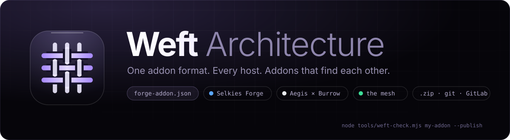
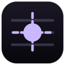
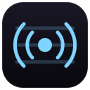
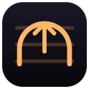

<p align="center">
  
</p>

<p align="center">
  <a href="LICENSE"></a>
  
  
  
</p>

<p align="center">
  <b><a href="#-what-weft-is">What it is</a></b> ·
  <b><a href="#-the-examples">Examples</a></b> ·
  <b><a href="#-how-they-link">How they link</a></b> ·
  <b><a href="#-make-your-own">Make your own</a></b> ·
  <b><a href="SPEC.md">The spec</a></b> ·
  <b><a href="prompt.md">For AI agents</a></b>
</p>

---

**Weft** is the architecture behind every addon on **[Selkies Forge](https://github.com/adatskov-wcpss/animated-fiesta)** and **[Aegis × Burrow](https://github.com/alexd-aero/aegis-burrow)**. An addon is a folder with one `forge-addon.json` and a few bash scripts, in any language, in any git repository or archive. Write it once, and it installs, updates, reports its state and uninstalls in either host. Weft addons also **find each other**, on the Weft mesh, without anyone wiring them together.

> In weaving, the warp threads stay put, and the **weft** is the thread that runs across them and holds the cloth together. The hosts are the warp; your addons are the weft.

## 🧵 What Weft is

| | |
|---|---|
| **One manifest** | `forge-addon.json`: id, name, version, scripts, actions, settings, requirements. Both hosts read it with the same rules ([SPEC.md §2](SPEC.md#2-forge-addonjson)) |
| **Five scripts** | `detect`, `install`, `update`, `uninstall`, `status`, plus up to eight actions. bash, unattended, idempotent ([§4](SPEC.md#4-scripts)) |
| **One environment** | `ADDON_ID`, `ADDON_DIR`, `ADDON_DATA`, `ADDON_SETTING_<KEY>`, `ADDON_HOST`… set by every host ([§5](SPEC.md#5-the-environment)) |
| **Talking back** | `::progress`, `::phase`, `::open`, `::warn` ([§6](SPEC.md#6-talking-back)) |
| **Platforms** | One addon for both hosts by default. `"platforms": ["burrow"]` or `["selkies-forge"]` when it needs one host's API ([§2](SPEC.md#2-forge-addonjson)) |
| **Linking** | Already running? A host links the running copy instead of starting another ([§7](SPEC.md#7-linking)) |
| **The mesh** | `~/.config/weft/mesh/<id>.json`: each running addon announces itself, and the others read it ([§8](SPEC.md#the-mesh)) |
| **Any source** | GitHub, GitLab (subgroups, self-hosted), Codeberg, any git URL, a `.zip` / `.tar.gz` link (inspected statically first), a local folder ([§3](SPEC.md#3-sources)) |

## 📦 The examples

Every one is stable, tested on both hosts, and small enough to read in a few minutes. Add any of them by pasting its link on a host's **Addons** page.

| | Example | Runs on | Shows |
|---|---|---|---|
|  | **[Hello Weft](examples/hello-weft)** | both | The complete skeleton: every script, settings, an action, status with a port, linking, a mesh entry. **Start here** |
|  | **[Weft Beacon](examples/beacon)** | both | A provider: announces itself (and a message) on the mesh |
|  | **[Weft Pulse](examples/pulse)** | both | A consumer: a live board of the mesh. Its host registers with it (`integration.dir`) |
|  | **[Weft Relay](examples/relay)** | Burrow only | A host API: gives every mesh addon a Burrow address, announces them back |
|  | **[Weft Shelf](examples/shelf)** | Selkies Forge only | A host API: lists the Forge's desktops, shares them on the mesh |

```text
https://github.com/alexd-aero/weft/tree/main/examples/pulse
```

## 🔗 How they link

```
            Selkies Forge                                   Aegis × Burrow
  ┌──────────────────────────────┐               ┌──────────────────────────────┐
  │ Weft Shelf ──items: desktops─┼──┐         ┌──┼─ Weft Relay ──routes: urls── │
  │ Weft Pulse ◀─ reads the mesh │  ▼         ▼  │  (BURROW_SOCKET → tunnels)    │
  │   ▲ selkies-forge.json       │ ~/.config/weft/mesh/<id>.json                 │
  │   └ (integration.dir)        │  ▲         ▲  │ Weft Beacon (linked: the      │
  │ Weft Beacon ─ announces ─────┼──┘         └──┼─ Forge runs it, Burrow shows) │
  └──────────────────────────────┘               └──────────────────────────────┘
```

- **Beacon** announces itself on the mesh.
- **Shelf** puts the Forge's desktops on its entry.
- **Relay** publishes every mesh addon through Burrow, and puts the public addresses on *its* entry.
- **Pulse** shows all of it, plus the host that registered with it.
- None of them knows the others exist until they meet on the mesh.

Install Beacon in one host, add it in the other, and the second host **links** it rather than starting a second Beacon.

## 🛠️ Make your own

```bash
git clone https://github.com/alexd-aero/weft && cd weft
cp -r examples/hello-weft my-addon           # always start from the skeleton
$EDITOR my-addon/forge-addon.json            # new id, name, settings…

node tools/weft-check.mjs my-addon           # the manifest, every script, the vendored helpers
node tools/weft-run.mjs my-addon install     # play a host: install, status, update, uninstall
node tools/weft-run.mjs my-addon status --host burrow
node tools/weft-check.mjs my-addon --publish # also requires the credits, before you publish
```

| Tool | What it does |
|---|---|
| `tools/weft-check.mjs` | Validates statically, with the hosts' own rules: the manifest, scripts (`bash -n`, shebang, no machine-specific paths), vendored helpers, `platforms` vs `requires`, credits. Runs nothing |
| `tools/weft-run.mjs` | Plays a host: the same environment and directives, data in `.weft-dev/`. `--host`, `--set KEY=V`, `--adopt`, `--purge`, `--bind` |
| `tools/lib.sh` · `tools/mesh.py` | The shared helpers every example vendors as `weft/lib.sh` and `weft/mesh.py`: services, config, health, the mesh, pages |

**Building with an AI agent?** Give it **[prompt.md](prompt.md)** first. It is strict on purpose: the exact format, what never to invent, how to prove the addon works, and the credits.

## 🙏 Credits, and publishing yours

Weft, Selkies Forge and Aegis × Burrow are MIT licensed and free. A published Weft addon's README ends with:

```markdown
## Credits

Powered by the [Weft Architecture](https://github.com/alexd-aero/weft). Runs on [Selkies Forge](https://github.com/adatskov-wcpss/animated-fiesta) and [Aegis × Burrow](https://github.com/alexd-aero/aegis-burrow).
```

`weft-check --publish` checks for it.

## Credits

Powered by the Weft Architecture, which this repository defines. Runs on [Selkies Forge](https://github.com/adatskov-wcpss/animated-fiesta) and [Aegis × Burrow](https://github.com/alexd-aero/aegis-burrow).

<p align="center"><sub>The Weft Architecture · MIT · threads that hold it all together</sub></p>
